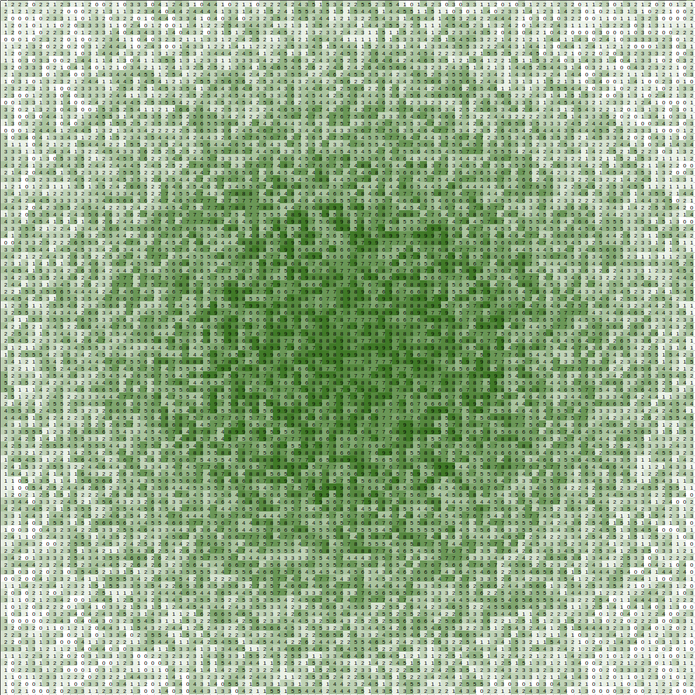
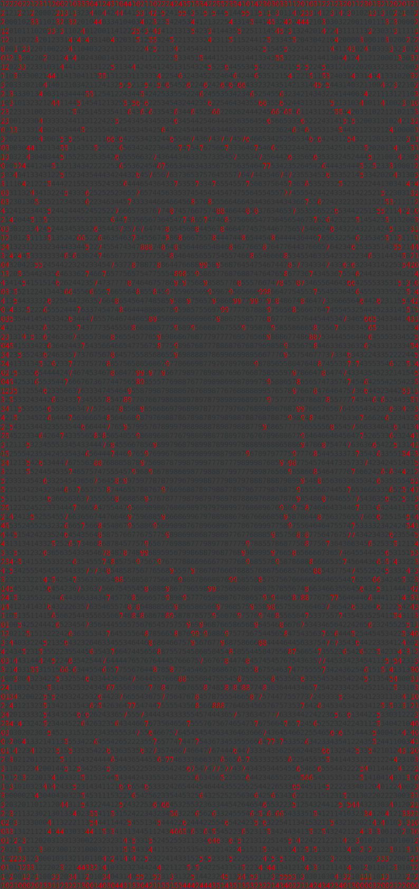
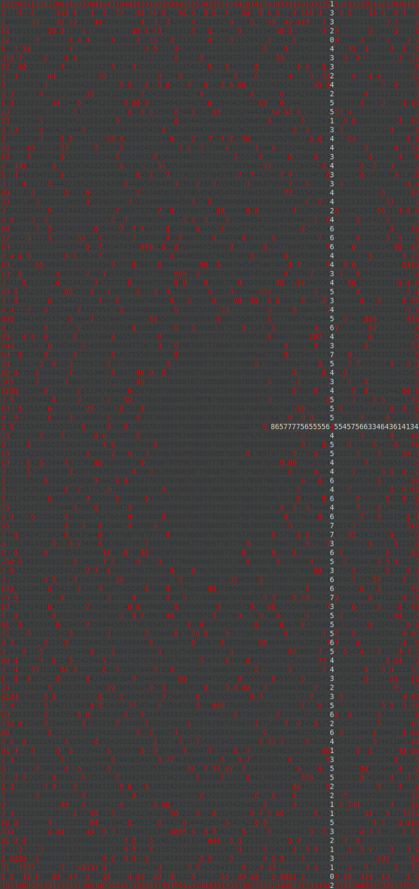
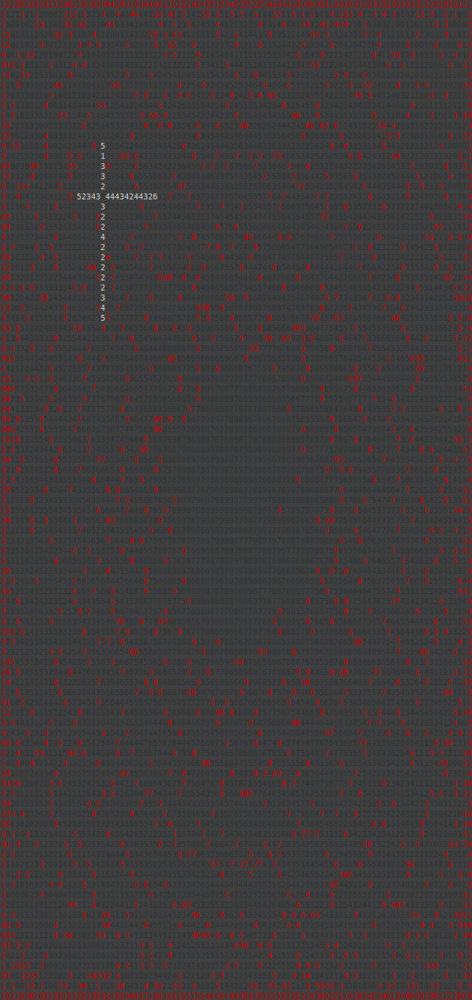
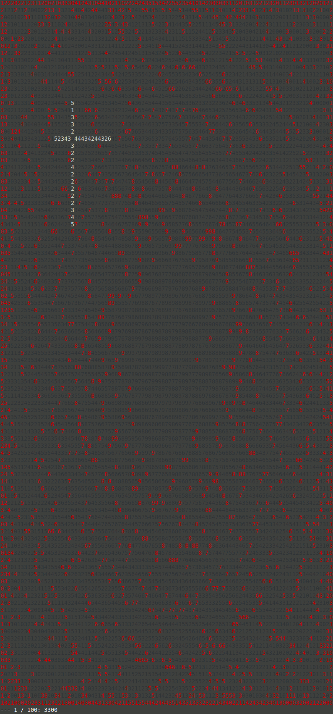

# Day 08: Treetop Tree House

## [Part one description](https://adventofcode.com/2022/day/8) (adventofcode.com)

**tl;dr**: A counting problem!  [Learned about Python `slice`s](#solution-1) to generalize my solution and reduce code repetition. Made some pretty command-prompt pictures and [my first-ever gif](#making-a-gif-of-top-100-scenic-scoring-trees-not-visible-from-exterior)!

If possible, please view this document on a landscape monitor to fully appreciate the images!


## Part One

### Problem Breakdown

The input is a grid of integers [0, 9] that represent tree heights.  The challenge for the first part is to count the number of trees that are visible from outside the grid forest.  There isn't any complicated geometry involved - instead, there are simple rules to define tree visibility:
1. If a tree is on the outside of the grid, it is visible.
2. A tree is visible if all of the other trees between it and the grid edge are shorter than it per-row/column.  A tree is visible if it can be seen from one or more of the four grid sides.

The justification for this counting is that the Elves want to build a tree house that is not visible from the outside of the forest and would like to find all candidate trees.

Here is what the input text file looks like in a spreadsheet with conditional formatting applied - there's a large, central group of tall trees with shorter trees in the periphery.




### Solution

I decided to write a "`Tree`" `class` to represent each tree in the grid so that I could store visibility info (whether it's visible from top/bot/left/right) along with each tree.

I parsed the input file into a 2-D `list`-of-`list`s.  Each `list` contains a row of `Tree`s.  Then, to count the number of visible trees, I iterated over each of the grid's four sides and used `bool` flags within each `Tree` object to indicate whether it was visible from a given side.  Afterwards, I looped over the grid one more time to count all of the trees that were visible from any side!

This solution used 5 `for` loops - one for each of the directions, and a final loop to count the number of visible trees.  In hindsight, I could have created a `set` of 2-tuples of tree coordinates and added to the `set` each time I found a tree that was visible from each direction.  This would have resulted in 4 loops over the grid, since the `set` takes care of duplicate detection -- if an element is already in the `set`, trying to add that element again doesn't have any effect.

To help me with debugging during development, I wrote a function to print the tree grid state with coloring in the command prompt.  Here is what the grid of trees looks like when visible trees are red and invisible trees are black:



The central cluster of trees is largely invisible, because of the outer ring of height-9 trees!  The command prompt output is stretched compared the the spreadsheet due to the size of the characters (rectangular, vs square spreadsheet cells).


## Part Two

### Problem Breakdown

This time, instead of counting trees that are visible from the outside of the grid, we are concerned with finding a suitable tree to host the tree house for the Elves, who stipulate that they
> would like to be able to see a lot of trees

from their tree house.  Note that there is not a restriction on the chosen tree's visibility from outside the grid - we've abandoned the work done for part one.

A tree is visible from another tree if the *to* tree's height is the less than or equal to the *from* tree.  Each tree has four viewing directions - up, down, left, right - and we neeed to count all of the trees that are visible from each direction that meet the visibility criteria above.  For a given viewing direction, we stop counting once we encounter a tree whose height is greater than or equal to our *from* tree.

This is a counting problem, but the we're not finding the tree that can see the highest *number* of trees - instead, we're calculating each tree's `scenic score`, which is the product of the number of trees visible in each of the four directions.


### Solution

I wrote a function to calculate the `scenic score` of every tree in the grid.  This means looping over the grid, and for each tree, looking up/down/left/right from that tree to count how many trees are visible.

**Computational complexity**

If the grid's size is M x N, and I need to loop over the entire grid of trees to calculate the `scenic score` of each tree, that's *O(MN)*.

For each tree, I need to look in all four directions from that tree to count how many trees it can see.  The maximum number of trees that can be visible are the number of trees between our origin tree and each edge, *(M-1) + (N-1)* trees.  Therefore, the overall computational complexity is *O(MN(M + N - 2))*, or *O(MN(M+N))*.

Since the example and input grids are squares, *M* = *N*, which results in a runtime complexity of *O(2N^3)* = *O(N^3)*, which is cubic-time!  It's slow, but for *M* = *N* = 99, it ran on my computer without issue.

**Code brevity - learning about Python `slice`s**

I noticed that the `for` loops I wrote for part one were very similar, and I wondered if there was a way to combine them.  Instead of only iterating over a row/col in a fixed direction (forward or reverse) to achieve the up/down/left/right scans, I parameterized my loop for calculating a single `Tree`'s `scenic score`.  It took me a while to realize that `None` was a valid argument for `slice()`!

```python

scenic_score = 1

directional_passes = [
    ('north', row_idx > 0,          slice(row_idx-1, None, -1), slice(col_idx, col_idx+1)),
    ('south', row_idx < num_rows-1, slice(row_idx+1, None,  1), slice(col_idx, col_idx+1)),
    ('east',  col_idx < num_cols-1, slice(row_idx, row_idx+1),  slice(col_idx+1, None,  1)),
    ('west',  col_idx > 0,          slice(row_idx, row_idx+1),  slice(col_idx-1, None, -1))
]

for look_dir, not_border_tree_condition, row_slice, col_slice in directional_passes:
    visible_trees = 0
    if not_border_tree_condition:
        breakout = False
        for tree_row in tree_grid[row_slice]:
            for comp_tree in tree_row[col_slice]:
                visible_trees += 1
                if comp_tree.height >= tree.height:
                    breakout = True
                    break
            if breakout:
                break
    scenic_score *= visible_trees
    # this occurs for edge trees
    if scenic_score == 0:
            return scenic_score
    return scenic_score
```

**Solution printout**

I generated a colorful command-prompt printout showing the tree with the highest `scenic score`!  I carried forward the coloring from part one to make it more colorful.




## Bonus - having fun with the problem!

It peeved me that the work done for part one was discarded for part two!  At first, the Elves were looking for a secluded tree house, but the tree with the largest `scenic score` is visible from three grid edges - not exactly private!

**I was curious to see which tree in the grid had the highest `scenic score` while also not being visible from the forest exterior.**

I re-wrote my `scenic score`-calculating function to not throw away any work - instead of finding the score for each tree and taking the max within the same function, I split up the work into two separate functions - one to calculate the score for each tree, and another to find the max for part two.

This allowed me to also write a function to answer my bonus question, since I could loop through the list to answer it!

This is the tree with highest `scenic score` that is not visible from the forest exterior:



### Making a `gif` of top 100 scenic-scoring trees not visible from exterior

I decided to make an animation!  I originally made it in the command prompt, but I couldn't share that on GitHub and did not want to manually take 100 screenshots to make a `gif`.

I used the [`mss` module](https://python-mss.readthedocs.io/) to take cropped screenshots of the command prompt output. *"MSS" stands for Multiple Screen Shots, since the module is fast enough for use in real-time settings, according to the authors!*

Then, I took the 100 individual images and used Gimp to create the `gif` following [this excellent guide](https://neondigitalarts.com/how-to-make-a-gif-using-gimp-software/).  I've never made a `gif` before, and it was pleasantly easy to do!

