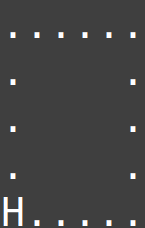
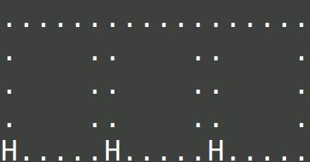
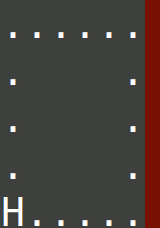
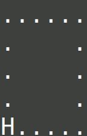
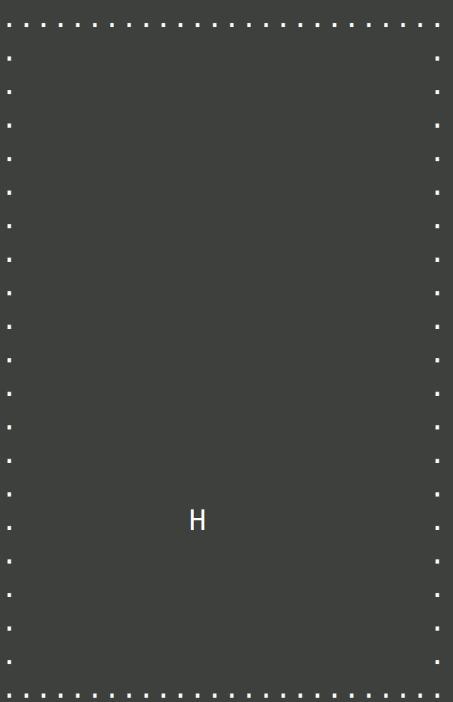
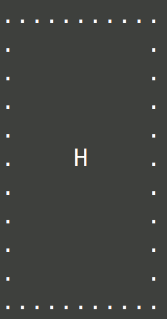

# Day 09: Rope Bridge

## [Part one description](https://adventofcode.com/2022/day/9) (adventofcode.com)

#### tl;dr

[Wrote unit tests](#unit-testing-test_solutionpy) (which were hugely helpful with debug and development), supported by a [robust simulation state printout function](#worked-example-one-animation) with three levels of granularity to compare to the puzzle description's worked examples.  Made a [perfectly looping gif of a spiralling rope](#bonus---perfectly-looping-gif-bonus_movespy) for fun!

## Part One

### Problem Breakdown

This puzzle involves simulating a simplified rope with two knots.  The input contains the series of relative movements applied to the *head*  (H) knot (moving it up/down/left/right by a specified number of grid spaces), and I must simulate what happens to the *tail* (T) knot in response.

Simulation rules provided:

0. The knots must always be adjacent after a move is applied to H and T's reaction is simulated- either in same row/col or diagonal.

1. If H and T are in the same grid space, H is above T.  If this is the result of moving H, T does not need to move because Rule 0 is not violated.

2. If H and T are in adjacent in same row or col prior to moving, and H is moved one step away from T in the row or col of adjacency, T must make the same move to remain close enough to H and satisfy Rule 0. 

3. Otherwise, if H and T are diagonally adjacent prior to moving H, T must move diagonally to keep up and ends up in the same row or col as H.

During the simulation, I need to keep track of the grid positions that T visits and count the number of unique positions visited.

### Solution

#### Setup - defining data structures

I invested time into defining useful data structures (listed here in their Part One versions) to express puzzle components to facilitate easier solution implementation:

- `Point_2D`: a `class` to represent an (x, y) point on the grid.   Wrote `__repr/str__`, `__add/iadd/sub/mul__`, and `__eq/hash__`, dunder/magic methods for convinience

- `Move`: a `namedtuple` containing the atomic transformation (up/down/left/right one grid space, as a `Point_2D` object), number of repetitions, and name (string representation of move direction)

- `Grid`: a `namedtuple` containing two `Point_2D`s (top left, and bottom right coords) which define the grid boundaries.

#### Simulation

Instead of using a `list`-of-`list`s to keep track of the grid state like in Day08, I realized that each knot could be represented perfectly by a `Point_2D` object, to which I could apply moves (also containing `Point_2D` objects) as needed!  No `lists` needed :grin:

The main simulation loop is quite simple:
1. Initialize all knots to start position
2. Iterate over list of moves (already parsed from input text file).  Apply each move and update the knot positions!

I added two grid options -- fixed and dynamic.
- Fixed grid requires knowledge that the rope will never move outside of the grid coordinates.  I used this for my unit tests during development and for generating animations.
- Dynamic grid starts as a 1x1 which grows as the rope head is moved.  I used this for the puzzle input, because I didn't know in advance how large of a grid would be required to fit the entire move list prior to successfully running the simulation!

#### Unit Testing ([`test_solution.py`](./test_solution.py))

This puzzle was more involved than prior days', and I decided to extend the practice of matching the printout format of the puzzle description and write unit tests to directly compare my simulation output to the description's worked example using Python's builtin `unittest` module.

Writing unit tests forced my code to be more modular.  Instead of adding code to print out the grid state within the main simulation loop, I wrote a generic function, `generate_print_grid_string`, that generates a single string representing the entire grid with a list of items (each of them a `Point_2D`).  I can use this function in my simulation loop for printing the grid state to the command prompt and *also* for generating the strings in my unit tests, for comparison against the puzzle description's worked example strings!

#### Animation

The puzzle input text file's move list resulted in a grid that was 364 characters wide and 268 characters tall.  This proved to be too large to render on my portrait-oriented 1080p monitor, so I don't have an animation of the full puzzle solution.  However, here are the example motions for part one:

## Part Two

### Problem Breakdown

Instead of simulating a rope with two knots (H, T), I must now simulate the movement of a rope with *ten* knots (H, 1, 2, ... , 9) while still keeping track of the number of unique grid positions visited by the last knot (9).

### Solution

The puzzle description warns that, for 2+ knots, 

> more types of motion are possible than before, so you might want to visually compare your simulated rope to the one above.

For me, this meant adding more unit tests to perform the comparison automatically!

There were two major changes in my simulation:
1. I now need to deal with a cascade of movements after moving H.
    - Moving knot H might mean moving knot 1.  If knot 1 moves, knot 2 might need to as well, and so on until the 9th knot.
    - Not every movement of H results in all 9 follower knots moving - the cascade stops with the first knot that doesn't require moving to satsify the knot-adjacency rule.
2. The rules for moving knot pairs are more complicated than before, when I was dealing with a single knot pair (H, T).

Working out the new rules was especially tricky, and my unit tests were very useful for pinpointing the issues with my simulation.  While part one had ample explanations for the knot simulation requirements (in written and worked example form), part two was more vague and required careful attention to the worked examples.

The rule for updating the lead knot's position stayed the same:  just apply the move directly to the H knot.

The rules for updating the following knot became more complicated:
1. If following knot is 'touching' lead knot, no need to move it.
2. (**new!**) If the leading knot has made a diagonal move and is...
    1. in the same row or col as the following knot, move the follower along that same row/col.
    2. not in the same row or col as the following knot, the follower also makes the same diagonal move.
3. If the lead knot started in the same row/col as follower and moves further away in that same row/col, apply the same move to the follower.
4. (**new!**) If our lead knot made a diagonal move (H can't do that, it must be a later knot), apply a diagonal move to the follower.
5. Otherwise, the follower knot takes the lead knot's old position.

#### Worked example one animation

Within the simulation loop, I added the option to print the grid state at three granularities, all of which are shown below!
1. Updating per knot movement
2. Updating after each atomic move is complete (move head U/D/L/R 1 square)
3. Updating after each move is complete

<!-- 

 -->

<!-- https://legacy.imagemagick.org/script/command-line-options.php -->
<!-- https://legacy.imagemagick.org/Usage/ -->
<!-- https://legacy.imagemagick.org/Usage/anim_basics/ -->
This gif was a lot harder to make than I expected - I couldn't find an easy way to play gifs side-by-side.  I instead downloaded and used ImageMagick (command-line image manipulation tool) within a [bash script](../media/day09/parttwo_ex1/gifjoin), thanks to a well-explained [StackOverFlow answer](https://stackoverflow.com/a/30932152)!

Additionally, determining how to line up the frames for the three animations took several tries, and I settled on ensuring the lead knots stayed in sync, even though that distorts the time-steps the second and third simulations relative to the first.  *Aligning the gifs by simulation frame, once each move is complete, makes for a visually jarring gif*).

#### Worked example two animation

## Bonus - perfectly looping GIF! ([`bonus_moves.py`](bonus_moves.py))

I've always wanted to make a perfectly looping GIF, and decided to play around with spirals to achieve that.  I implemented a function for moving the lead knot in an outward spiral from a central point, and another for an inward spiral back to the center.

I had to also "wiggle" the rope from side-to-side until all of the knots were back on the start point to perfectly reset everything.

Additionally, I added an option for my string-generating function to print out the position of the tail knot live, and it made an interesting shape!

