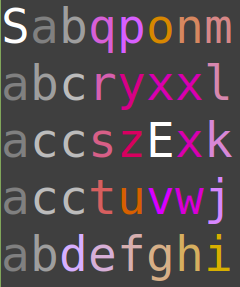
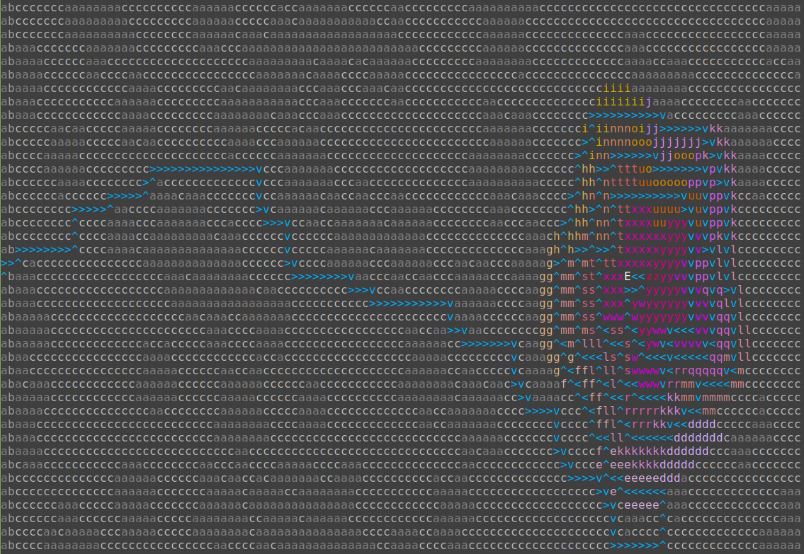

# Day 12: Hill Climbing Algorithm

## [Part one description](https://adventofcode.com/2022/day/12) (adventofcode.com)

**tl;dr**:

.


## Part One

### Problem Breakdown

A rectangular grid of letters is provided as an input.  Each letter, [*a*, *z*], represents the height of the grid square at those coordinates.

The task is to find the shortest path from the start square (labelled *S*, with height *a*) to the end square (labelled *E*, with height *z*).

There are two rules for traversing the tile grid:
1. Moving from tile A to tile B is allowed if $height_{B} - height_{A} \leq 1$.
2. From current tile (*x*, *y*), can access up to 4 other tiles: (*x* $\pm$ 1, *y*) and (*x*, *y* $\pm$ 1).


### Solution

I briefly pondered writing my own algorithm, but abandoned that when I remembered learning about Dijkstra's shortest-path algorithm in a college data structures course.  Its [Wikipedia page](https://en.wikipedia.org/wiki/Dijkstra%27s_algorithm) the contains a pseudocode description, which I used as the foundation for my solution.

#### Visualizing the inputs

*Really, I generated these images after-the-fact, but structurally it makes the most sense here.*

Previously, I thought only 8 colors could be used in the terminal, but discovered [otherwise](https://stackabuse.com/how-to-print-colored-text-in-python/#256colorsinrawpython) after some web searching.  Some Linux-based OSs support 256 colors in the terminal.  To check support, run the command  `echo $TERM` in the command prompt.  If the return value is `xterm-256color`, the OS supports 256 colors!!

After consoluting a [cheat sheet](https://www.ditig.com/256-colors-cheat-sheet) for the colors and their codes, I colored the the elevations to get a nice gradient on the hills:
- Letters [a, c]: greyscale; color codes 244, 247, 250 (ascending)
- Letters [d, z]: progression of plum -> gold -> pink -> orange -> red; color codes [183, 160] (descending)

Example:



Puzzle input, which has a much nicer hill than the example, due to its larger grid size:


#### Parsing input into graph

In order to use Dijkstra's algorithm for this problem, I needed to turn the input text file into a graph of vertices (nodes) and edges.  At first I used undirected edges, but realized that the height-based traversal rule meant that tile A might be reachable from B without the converse being true (B reachable from A) - this occurs when $height_{B} - height_{A} > 1$.

I used `namedtuples` to make two data structures - `Nodes` and `DirectedEdges`.  This made the data structure code simpler but resulted in more complicated print routines.  I was able to modify `Nodes` because `tuples` can contain mutable containers, such as `lists`!

Additionally, to validate my process, I wrote a function to visualize the directed graph.  The full input was too large to display within the command prompt, so here is a printout of the directed graph for the problem description example:


#### Trying to predict what might change for Part Two

Based on the title "Hill Climbing Algorithm" and the description's mention of climbing gear, I wondered whether Part 2 would feature our protagonist finding an abandoned set of climbing gear mid-hike and would gain the ability to climb hills.  If so, I'd need to change the traversal rules used to parse the input text file into a directed graph!  I represented the traversal rules as an anonymous / `lambda` function and passed it into the parsing routine:

```python
part_one_edge_rule_fn = lambda curr_node, adj_node: \
                            ord(adj_node.height) - ord(curr_node.height) <= 1

def parse_input_into_graph(inputfile, edge_rule_fn)
    ...

start_node, end_node, nodes = parse_input_into_graph(
    inputfile,
    edge_rule_fn=part_one_edge_rule_fn
)
```
#### My implementation of Dijkstra's algorithm

I augmented the algorithm from Wikipedia to not only provide me the shortest path between desired nodes, but also the shortest path from the source to each visited node.  This allows me to generate a printout of the shortest path overlaid over the input map for unit testing (against the example printout in puzzle description), as well as to generate pretty images.

However, I made two mistakes during my initial attempt, detailed below.  I wanted to use the Visual Studio Code built-in debugger for the second bug, but it didn't work out-of-the-box and I wasn't in the mood to figure out why.  Instead, I decided to learn about `pdb`, the standard library's debugging module!  The [docs](https://docs.python.org/3/library/pdb.html) were very helpful, and it helped me inspect the program state while investigating hypotheses.

##### 1. Improper handling start -> node shortest path list propagation

```python
start_to_neighb_dist_thru_curr_node = tentative_distance_from_start[current_coords] + edge.weight
start_to_neighb_shortest_known_path = tentative_distance_from_start[edge.node_to_coords]

if start_to_neighb_dist_thru_curr_node < start_to_neighb_shortest_known_path:
    # found shorter path - update!
    tentative_distance_from_start[edge.node_to_coords] = start_to_neighb_dist_thru_curr_node
    # write down best known path from source -> current node
    nodes[edge.node_to_coords].shortest_path_from_start.clear()         #  <--- THIS LINE WAS MISSING!
    for coords in nodes[current_coords].shortest_path_from_start:
        nodes[edge.node_to_coords].shortest_path_from_start.append(coords)
    nodes[edge.node_to_coords].shortest_path_from_start.append(current_coords)
```

I forgot the clear the current known shortest from start to current node, which resulted in a shortest path list that was much longer than the shortest path length reported by the algorithm (it's computed separately).

##### 2. Improperly choosing next node

```python
min_tentative_distance = math.inf
for coords in unvisited_coords:
    if tentative_distance_from_start[coords] < min_tentative_distance:
        current_coords = coords
        min_tentative_distance = tentative_distance_from_start[coords]  #  <--- THIS LINE WAS MISSING!
```

I forgot to update `min_tentative_distance`, the value against which I compared all unvisited nodes' distances from start.

Unlike Python `dicts`, which preserve inserted element input order [as of CPython 3.6+](https://stackoverflow.com/a/39980744), `sets` make [no such guarantee](https://stackoverflow.com/a/61467874).

The missing line means that the `min_tentative_distance` was never lower than infinity, so the last node from the `unvisited_coords` set that has a finite distance is the next node used by the algorithm.

Instead of expanding outwards from the center smoothly and filling in gaps, the search is quite sporadic and resulted in a "shortest path" of 458 vs the actual 380.

Below is an animation of the incorrect implementation in action.  This animation helped me hone in on my bug - I saw the behavior of the algorithm was much different than the animations in Wikipedia!


##### Correct implementation

Here's the shortest path through the puzzle input, which my partner pointed out looks like a rose!



And here is the algorithm in action!  Making this GIF took a very long time on my laptop (old processor with integrated graphics and 8GB RAM), however it was fun to pick out the color scheme with my newly expanded 256-color palette.  I used a different colors than the height-annotated printout above to emphasize the hill's elevation profile!

Notice how some of the nodes are inaccessible (`c`s surrounded by `a`s):


## Part Two


### Problem Breakdown


### Solution


## Bonus 1 - Implementing the A* (best-first search) algorithm

While reading about Dijkstra's algorithm on Wikipedia, I came across the A* ("A-star") algorithm, which is described as a *best*-first search.  I decided to attempt an implementation!

Its [Wikipedia article](https://en.wikipedia.org/wiki/A*_search_algorithm) generously provides a description of the algorithm, as well as commented pseudocode.  I used the pseudocode as a base (implemented in Python), and later augmented it to try out different definitions of "best".

I really like the article's method for storing and reconstructing the shortest path from start to any visited node: using a map (`dict`), and for each node n (key) storing the prior node n-1 (value).  Then, to reconstruct shortest path from start, begin with the last node and work backwards.  This is *waaaaaaay* more space-efficient than in my Dijkstra's alg implementation, where I store the shortest path as a list on each node!

```python
def reconstruct_path(camefrom, current_coords):
    path = deque([current_coords])
    while current_coords in camefrom:
        current_coords = camefrom[current_coords]
        path.appendleft(current_coords)
    return list(path)
```

I used the [Manhattan](https://en.wikipedia.org/wiki/Taxicab_geometry), or taxi-cab distance as my heuristic function *h(n)*, and later augmented this with more information in an attempt to further optimize the search.

I ended up making several changes to the pseudocode:
- I used a min-heap to implement a priority queue (a `list` + the `heapq` module from standard library).  In the pseudocode, they used a hash-set called *openSet*.  I called mine `exploration_boundary`.
    - I actually used a hash-set (`set`) as well, since adding new nodes to the heap requires a membership check.  This has a time-complexity of *O(n)* for `lists` but *O(1)* for `sets`.
    - This approach uses more memory in favor of faster membership lookup.  The animation below illustrates that the number of nodes in the `exploration_boundary` at any time is small compared to the number of nodes on the map, so perhaps this was a premature "optimization" on my part.

- Talk about the modification I made to the fscore (the value used to rank next-best-search nodes) to allow me to write different heuristics

Explain the rationale for each of my heuristic functions, and show the shortest path and if applicable, animation


## Bonus 2 - Using an off-the-shelf implementation of Dijkstra's algorithm

**Compare my solution with the off-the-shelf version, time how long each one takes for part one and part two!**


