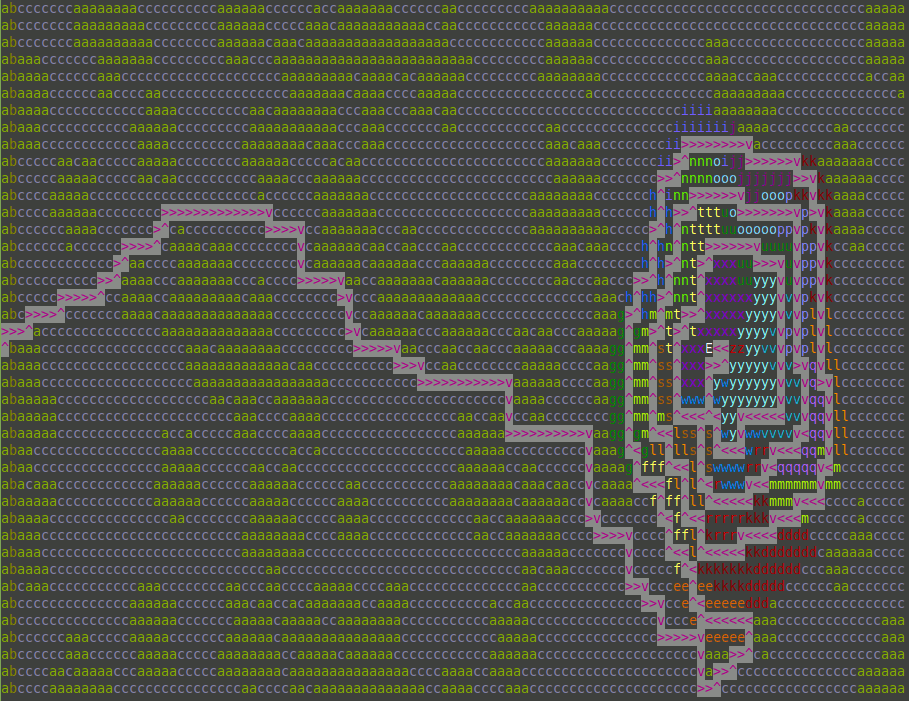
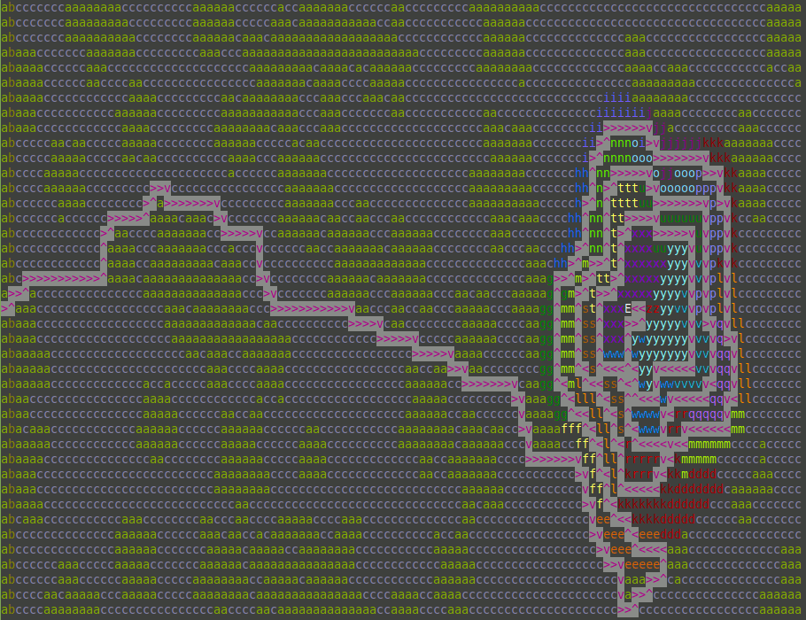

# Day 12: Hill Climbing Algorithm

## [Part one description](https://adventofcode.com/2022/day/12) (adventofcode.com)

**tl;dr**

Shortest-path algorithms ([Dijkstra's](#correct-implementation), [A*](#bonus---implementing-the-a-best-first-search-algorithm)) and more GIFs :)


## Part One

### Problem Breakdown

A rectangular grid of letters is provided as an input.  Each letter, [*a*, *z*], represents the height of the grid square at those coordinates.

The task is to find the shortest path from the start square (labelled *S*, with height *a*) to the end square (labelled *E*, with height *z*).

There are two rules for traversing the tile grid:
1. Moving from tile A to tile B is allowed if $height_{B} - height_{A} \leq 1$.
2. From current tile (*x*, *y*), can access up to 4 other tiles: (*x* $\pm$ 1, *y*) and (*x*, *y* $\pm$ 1).


### Solution

I briefly pondered writing my own algorithm, but abandoned that when I remembered learning about Dijkstra's shortest-path algorithm in a college data structures course.  Its [Wikipedia page](https://en.wikipedia.org/wiki/Dijkstra%27s_algorithm) the contains a pseudocode description, which I used as the foundation for my solution.

#### Visualizing the input

Previously, I thought only 8 colors could be used in the terminal, but discovered [otherwise](https://stackabuse.com/how-to-print-colored-text-in-python/#256colorsinrawpython) after some web searching.  Some Linux-based OSs support 256 colors in the terminal.  To check support, run the command  `echo $TERM` in the command prompt.  If the return value is `xterm-256color`, the OS supports 256 colors!!

After consoluting a [cheat sheet](https://www.ditig.com/256-colors-cheat-sheet) for the colors and their codes, I colored the the elevations to get a nice gradient on the hills.  I used three rounds of ROYGBIV (rainbow) coloring for contrast between the different elevations:


#### Parsing input into graph

In order to use Dijkstra's algorithm for this problem, I needed to turn the input text file into a graph of vertices (nodes) and edges.  At first I used undirected edges, but realized that the height-based traversal rule meant that tile A might be reachable from B without the converse being true (B reachable from A) - this occurs when $height_{B} - height_{A} > 1$.

I used `namedtuples` to make two data structures - `Nodes` and `DirectedEdges`.  This made the data structure code simpler but resulted in more complicated print routines.  I was able to modify `Nodes` because `tuples` can contain mutable containers, such as `lists`!

Additionally, to validate my process, I wrote a function to visualize the directed graph.

This was my first take -- 5 horizontal spaces between characters and 3 lines between characters yielded an approximate square shape!


However, rendering the graph this way made it impossible to fit the puzzle input's graph onto the screen.  I shrank down the arrows as much as possible, and was able to fit the input graph:


Below is a zoomed-in portion of the hill: `|` and `-` are bidirectional connections, whereas `>`, `<`, `v` and `^` are one-way.


#### Trying to predict what might change for Part Two

Based on the title "Hill Climbing Algorithm" and the description's mention of climbing gear, I wondered whether Part 2 would feature our protagonist finding an abandoned set of climbing gear mid-hike and would gain the ability to climb hills.  If so, I'd need to change the traversal rules used to parse the input text file into a directed graph!  I represented the traversal rules as an anonymous / `lambda` function and passed it into the parsing routine:

```python
part_one_edge_rule_fn = lambda curr_node, adj_node: \
                            ord(adj_node.height) - ord(curr_node.height) <= 1

def parse_input_into_graph(inputfile, edge_rule_fn)
    ...

start_node, end_node, nodes = parse_input_into_graph(
    inputfile,
    edge_rule_fn=part_one_edge_rule_fn
)
```
####  Dijkstra's algorithm

##### Initial implementation

I augmented the algorithm from Wikipedia to not only provide me the shortest path between desired nodes, but also the shortest path from the source to each visited node.  This allows me to generate a printout of the shortest path overlaid over the input map for unit testing (against the example printout in puzzle description), as well as to generate pretty images.

However, I made two mistakes during my initial attempt, detailed below.  I wanted to use the Visual Studio Code built-in debugger for the second bug, but it didn't work out-of-the-box and I wasn't in the mood to figure out why.  Instead, I decided to learn about `pdb`, the standard library's debugging module!  The [docs](https://docs.python.org/3/library/pdb.html) were very helpful, and it helped me inspect the program state while investigating hypotheses.

###### 1. Improper handling start -> node shortest path list propagation

```python
start_to_neighb_dist_thru_curr_node = tentative_distance_from_start[current_coords] + edge.weight
start_to_neighb_shortest_known_path = tentative_distance_from_start[edge.node_to_coords]

if start_to_neighb_dist_thru_curr_node < start_to_neighb_shortest_known_path:
    # found shorter path - update!
    tentative_distance_from_start[edge.node_to_coords] = start_to_neighb_dist_thru_curr_node
    # write down best known path from source -> current node
    nodes[edge.node_to_coords].shortest_path_from_start.clear()         #  <--- THIS LINE WAS MISSING!
    for coords in nodes[current_coords].shortest_path_from_start:
        nodes[edge.node_to_coords].shortest_path_from_start.append(coords)
    nodes[edge.node_to_coords].shortest_path_from_start.append(current_coords)
```

I forgot the clear the current known shortest from start to current node, which resulted in a shortest path list that was much longer than the shortest path length reported by the algorithm (it's computed separately).

###### 2. Improperly choosing next node

```python
min_tentative_distance = math.inf
for coords in unvisited_coords:
    if tentative_distance_from_start[coords] < min_tentative_distance:
        current_coords = coords
        min_tentative_distance = tentative_distance_from_start[coords]  #  <--- THIS LINE WAS MISSING!
```

I forgot to update `min_tentative_distance`, the value against which I compared all unvisited nodes' distances from start.

Unlike Python `dicts`, which preserve inserted element input order [as of CPython 3.6+](https://stackoverflow.com/a/39980744), `sets` make [no such guarantee](https://stackoverflow.com/a/61467874).

The missing line means that the `min_tentative_distance` was never lower than infinity, so the last node from the `unvisited_coords` set that has a finite distance is the next node used by the algorithm.

Instead of expanding outwards from the center smoothly and filling in gaps, the search is quite sporadic and resulted in a "shortest path" of 458 vs the actual 380.

Below is an animation of the incorrect implementation in action.  This animation helped me hone in on my bug - I saw the behavior of the algorithm was much different than the animations in Wikipedia!


##### Correct implementation

Here's the shortest path found:


And here is the algorithm in action!  Making this GIF took a very long time on my laptop (old processor with integrated graphics and 8GB RAM), however it was fun to pick out the color scheme with my newly expanded 256-color palette.

Notice how some of the nodes are inaccessible (`c`s surrounded by `a`s):


## Part Two

### Problem Breakdown

The new goal is to
> find the shortest path from **any square with elevation `a`** to the square marked `E`.

This problem is a trick question, since there is a single column of `b`s on the input grid.  This greatly reduces the number of `a`-tiles to try!

### Solution

To make the solution more general (ie not tailored to the puzzle input, and to allow unit testing) I wrote a simple rule to filter the nodes in the graph and find the `a`-tiles eligible for the shortest-path-to-end minimization:

```python
candidate_a_tiles = []
for node in nodes.values():
    if node.height != 'a':
        continue
    # look through all edges -- does it point to a 'b'?
    # shortest possible path up would be a -> b -> c -> ... -> z
    for edge in node.connections:
        neighbor = nodes[edge.node_to_coords]
        if neighbor.height == 'b':
            candidate_a_tiles.append(node.coords)
            break
```

I then ran a shortest-path algorithm ([A*](#bonus---implementing-the-a-best-first-search-algorithm)) from each `a`-tile to the end, and picked the shortest path among those!

There are 61 `a`-tiles in the puzzle input, and among them the one at `(0, 25)` had the shortest path (375).  The longest path was 400, from tile `(0, 0)`.  Here is the shortest path found from part two, versus part one:


## Bonus - Implementing the A* (best-first search) algorithm

While reading about Dijkstra's algorithm on Wikipedia, I came across the A* ("A-star") algorithm, which is described as a *best*-first search.  I decided to attempt an implementation!

Its [Wikipedia article](https://en.wikipedia.org/wiki/A*_search_algorithm) generously provides a description of the algorithm, as well as commented pseudocode.  I used the pseudocode as a base (implemented in Python), and later augmented it to try out different definitions of "best".

##### Data structure for storing shortest known path

I really like the article's method for storing and reconstructing the shortest path from start to any visited node: using a map (`dict`), and for each node n (key) storing the prior node n-1 (value).  Then, to reconstruct shortest path from start, begin with the last node and work backwards.  This is *waaaaaaay* more space-efficient than in my Dijkstra's alg implementation, where I store the shortest path as a list on each node!

```python
def reconstruct_path(camefrom, current_coords):
    path = deque([current_coords])
    while current_coords in camefrom:
        current_coords = camefrom[current_coords]
        path.appendleft(current_coords)
    return list(path)
```

### Implementation

I made two changes to the pseudocode:

- I used a min-heap to implement a priority queue (a `list` + the `heapq` module from standard library).  In the pseudocode, they used a hash-set called *openSet*.
    - I actually used a hash-set (`set`) as well, since adding new nodes to the heap requires a membership check.  This has a time-complexity of *O(n)* for `lists` but *O(1)* for `sets`.
    - This approach uses more memory in favor of faster membership lookup.  The animations below illustrates that the number of nodes in the `exploration_boundary` (priority queue) at any time is small compared to the number of nodes on the map, so perhaps this was a premature "optimization" on my part.

- The A* algorithm uses a function, *f(n)*, to determine which node *n* to next choose for exploration.
    - *f(n) = g(n) + h(n)*, where
        - *g(n)* is the shortest known path from start to node *n*
        - *h(n)* is the "heuristic function" that estimates the shortest path from node *n* to end
            - Dijkstra's algorithm is equivalent to A* where *h(n) = 0*
            - For A* *h(n)*, I used the [Manhattan](https://en.wikipedia.org/wiki/Taxicab_geometry), or taxi-cab distance per the A* algo wiki page description's recommendation

    I changed the formulation of the "f-score" *f(n)* - instead of being a single integer value, I made it a tuple of values so that I could prioritize different problem parameters.  The priority queue tries to minimize the f-score, which means it sorts first by the first tuple index, and to break ties looks at the second, and so on.


### Results using fscore = *f(n)*


#### *f(n)* = *g(n)* + *h(n)*, where h(n) is the Manhattan distance between node and end

```python
def manhattan_distance(point_one, point_two):
    x1, y1 = point_one
    x2, y2 = point_two
    return abs(x2 - x1) + abs(y2 - y1)
```

This algorithm found the same shortest path as Dijkstra's, 380 steps between start and end!  The shortest path it found is not exactly the same, though.  In the animation below, the magenta path is Dijkstra's and the blue is A*'s:



The order in which this formulation of A* visited nodes was different, as well, since it prioritized nodes not only based on distance from start, but also to their estimated distance to the end.  The animation below shows the full run of the algorithm - the gray-colored squares are the "exploration boundary", the set of nodes from which we can expand our search.


After making the animation, I was surprised to find that while this algorithm prioritized nodes differently, it still explored all the way around the big hill before finding the goal, just like Dijkstra's and thought about how to improve the search efficiency.


### Experimenting with other formulations of fscore

I tried augment the heurustic function to find a more optimal solution for the puzzle input.  It's likely that if I were to generate random heightmaps, these more complicated f-scores would perform worse than the vanilla f-score above, but it was fun to experiment!


#### 1. `(height_diff, f(n))`

The input heightmap consists primarily of `c`-elevation tiles, with "pits" of `a` tiles.  Due to the traversal rules, once one of these `a`-pits is entered, escape is not possible.

To avoid searching these `a`-pits, I wanted to come up with a way to prioritize hill-climbing, but was initially stuck on how to proceed because modifying *h(n)* to incorporate vertical distance as well as horizontal would necessitate modifying *g(n)*, which I wanted to avoid.

I had the idea of not using a single integer for the fscore - instead, I used a `tuple`!  The min-heap sorts `tuples` just fine, and I like the solution because it allows me to specify multiple levels of tie-breaker rules.  This is the first fscore-tuple function I wrote (it's an argument into my A* algorithm):

```python
def height_then_f_of_n(*, neighbor_node, end_node, g_of_n, h_of_n, **kwargs):
    # Rationale - penalize doing downhill to avoid exploring lower areas
    return (
        ord(end_node.height) - ord(neighbor_node.height), # height difference
        g_of_n + h_of_n                                   # original fscore
    )
```

Tiles are prioritized for exploration based on their height difference relative to the goal (since this is a min-heap).  In case of a tie, the original *f(n)* is used.

This version yielded a slightly different shortest path than the original fscore function, though both paths are 380 steps long.  Here is a comparison between the two versions of A*:


The big difference is the order in which nodes are visited during the search, the `a`-pits are entirely ignored!  Once the spiralling hill is reached (first tile with elevation `d`), all exploration of the plains immediately ceases, which was very satisfying to see.


This prioritiziation worked well for this map, since it has one large hill and `a`-pits, but would completely search any smaller hills it found if this map were instead rolling hills, which might be less efficient than other approaches.


#### 2. `(height_diff, dotprod, f(n))`

I was pleased with the outcome of the prior fscore augmentation that prioritized height, but noticed that the search stagnates when blocked by `a`-pits.  In these cases, the exploration boundary slowly expands in all directions, which isn't what an explorer would do in real life.  If I had to start at a low elevation and climb up to a mountain peak, I'd orient myself towards the mountain at all times.

This led me to think about orientation, and I decided to use the vector dot product within my priority.  I reasoned that I could incentivize progressing towards the goal instead of away from it if I computed the dot product between a vector from the current -> neighbor node (potential exploration direction) and the current -> end node (desired end).

```python   
def normalized_dotprod(v1, v2):
    return np.dot(v1, v2) / (np.linalg.norm(v1) * np.linalg.norm(v2))

def height_dotprod_f_of_n(*, current_node, neighbor_node, end_node, g_of_n, h_of_n, **kwargs):
    height_diff = ord(end_node.height) - ord(current_node.height)
    estimated_dist_to_end = g_of_n + h_of_n
    if current_node == end_node:
        return (height_diff, 0, estimated_dist_to_end)
    dotprod = normalized_dotprod(to_vector(current_node, neighbor_node), to_vector(current_node, end_node))
    return (height_diff, dotprod, estimated_dist_to_end)
```

Here is the "shortest path" (510 steps) found by this fscore vs the original *f(n)* (380 steps):


I later realized that I was using the dot product incorrectly - when normalized, normalized its output is [-1, 1], where
- +1 means the vectors are parallel, both pointing towards goal
- 0 means the vectors are perpendicular
- -1 means the vectors are parallel one pointing towards goal, the other away

This is a valid way to deduce orientation relative to the goal, but when using this in a min-heap the priority becomes moving *away* from the goal (-1 < 0 < 1, and therefore that's the priority in which moves are made).

The A* wiki page talks about *admissibility*:

> A search algorithm is said to be admissible if it is guaranteed to return an optimal solution.  If the heuristic function used by A* is admissible, then A* is admissible.

Unlike Dijkstra's algorithm, which is guaranteed to find the shortest path, A*'s ability to find an optimal route depends on its heuristic function.  In this case, the fscore function I've written is actively fighting the search and results in a very convoluted "shortest path" - it is not admissible!


#### 3. `(height_diff, f(n), dot prod)`

Not realizing my implementation error regarding the dot product, I also tried a re-prioritized version of the fscore.  This one did actually find the real shortest path, despite the dot product working against the goal in cases of height and *f(n)* ties.  While the shortest path was found, additional nodes were considered relative to the first two A* attempts.


#### 4. `(height_diff, f(n), theta)`

After mulling over the problem further, I realized my mistake on variants 2/3 related to the vector dot product and the priority queue (explained in [section 2](#2-height_diff-dot-prod-fn)).

My first attempt at fixing this was to use the angle between the vectors, theta, as the tie-breaker instead of the vector dot prod (which is found by taking the inverse cosine of that value).  This re-maps the values from [0, 180] degrees and will work together with the min-heap to prioritize moving towards the goal rather than away from it.


#### 5. `(height_diff, f(n), neg_dotprod)`

I also tried again with the normalized dot product, this time multiplying it by -1 to fit with the min-heap.  Now,
- -1 means the vectors are parallel, both pointing towards goal
- 0 means the vectors are perpendicular
- +1 means the vectors are parallel one pointing towards goal, the other away

I didn't realize it until after seeing the shortest path, but this is actually the same fscore formulation as the the angle between vectors, just represented between [-1, 1] instead of [0, 180].

Here is the comparison against the angle-approach:


#### 6. `(height_diff, neg_dotprod, f(n))`

Given the success of the prior to approaches, I tried prioritizing direction over *f(n)*, which yielded a correct shortest path!


I also made a search animation for this approach:


#### 7. `(height_diff, f(n), h(n))`

The last fscore I tried involved using *h(n)* as a tie-breaker for height/*f(n)*, as a proxy for heading towards the goal.  Here it is compared with #1, fscore=(height_diff, *f(n)*):




### Comparison

The comparison animations above only show one side of the story -- what the shortest path looks like.  I would also like to compare these approaches based on how they process the graph, in terms of shortest path, number of nodes processed (all neighbors considered), number of nodes visited (distance from start is finite), and number of edges processed.

<!-- | Strategy | Shortest Path Length | New Nodes Processed | Total Nodes Processed | New Nodes Visited | Total Nodes Visited | New Edges Processed | Total Edges Processed |
| - | - | - | - | - | - | - | - |
| Dijkstra's                            |    380             |   4549   |  4549   | 4549 |   4549   |   7974   |  16482   |
| A* `f(n)`                             |    380             |   4525   |  4676   | 4538 |   4538   |   7904   |  16913   |
| A* `(height_diff, f(n))`              |    380             |   4548   |  2548   | 3305 |   3293   |   5398   |   9916   |
| A* `(height_diff, f(n), h(n))`        |    382 (380)       |   2530   |**2571** | 3299 |   3286   |   5381   | **9908** |
| A* `(height_diff, dotprod, f(n))`     |  **650** (**510**) |   2921   |  8415   | 4131 |   4131   |   6657   |  31033   |
| A* `(height_diff, f(n), dotprod)`     |    380             |   3041   |  3046   | 3675 |   3675   |   6278   |  11108   |
| A* `(height_diff, f(n), theta)`       |    382 (380)       |   3032   |  3100   | 3673 |   3672   |   6257   |  11252   |
| A* `(height_diff, f(n), neg_dotprod)` |    382 (380)       |   3032   |  3100   | 3673 |   3672   |   6277   |  11252   |
| A* `(height_diff, neg_dotprod, f(n))` |    390 (380)       | **2484** |  2644   | 3166 | **3166** | **5190** |   9593   | -->

#### Skipping already-visited nodes IS NOT allowed

| Strategy | Shortest Path Length | Nodes Processed | Nodes Visited | Edges Processed |
| - | - | - | - | - |
| Dijkstra's                            |    380    |  4549   |   4549   |  16482   |
| A* `f(n)`                             |    380    |  4676   |   4538   |  16913   |
| A* `(height_diff, f(n))`              |    380    |  2548   |   3293   |   9916   |
| A* `(height_diff, f(n), h(n))`        |    380    |**2571** |   3286   | **9908** |
| A* `(height_diff, dotprod, f(n))`     |  **510**  |  8415   |   4131   |  31033   |
| A* `(height_diff, f(n), dotprod)`     |    380    |  3046   |   3675   |  11108   |
| A* `(height_diff, f(n), theta)`       |    380    |  3100   |   3672   |  11252   |
| A* `(height_diff, f(n), neg_dotprod)` |    380    |  3100   |   3672   |  11252   |
| A* `(height_diff, neg_dotprod, f(n))` |    380    |  2644   | **3166** |   9593   |

#### Skipping already-visited nodes IS allowed

| Strategy | Shortest Path Length | Nodes Processed | Nodes Visited | Edges Processed |
| - | - | - | - | - |
| Dijkstra's                            |    380   |   4549   | 4549 |   7974   |
| A* `f(n)`                             |    380   |   4525   | 4538 |   7904   |
| A* `(height_diff, f(n))`              |    380   |   4548   | 3305 |   5398   |
| A* `(height_diff, f(n), h(n))`        |   *382*  |   2530   | 3299 |   5381   |
| A* `(height_diff, dotprod, f(n))`     |  **650** |   2921   | 4131 |   6657   |
| A* `(height_diff, f(n), dotprod)`     |    380   |   3041   | 3675 |   6278   |
| A* `(height_diff, f(n), theta)`       |   *382*  |   3032   | 3673 |   6257   |
| A* `(height_diff, f(n), neg_dotprod)` |   *382*  |   3032   | 3673 |   6257   |
| A* `(height_diff, neg_dotprod, f(n))` |   *390*  | **2484** | 3166 | **5190** |

Notable points:
- A* `(height_diff, f(n), h(n))`
    - Fewest number of nodes *processed*, 2571.  That's 2 less than without *h(n)* as tiebreaker.
    - 2nd fewest number of edges processed, behind Dijkstra's.
- A* `(height_diff, neg_dotprod, f(n))` had the fewest number of nodes *visited*, 3166.

Originally, I made a single table and was counting the new edges processed for Dijkstra's, and the total edges for A*.  This meant that Dijkstra looked like it was processing way fewer edges than any of my A* solutions.  Upon looking at the code I realized that there are two ways of defining the processing of an edge for Dijkstra's algorithm:
1. Counting *new* edges processed, because we know which nodes have a shortest path from start (they're not in the `unvisited_set`) - 7974.  This was my original implementation.
2. Counting all edges seen - 16482.

My original implementation of A* doesn't have a similar notion of "visited", so I can't skip any edges.  However, the A* wiki page discusses another property of the heuristic function, its *consistency*.  A heuristic is consistent if 
        
> *h(x)* $\le$ *d(x, y)* + *h(y)* for every edge (x, y) of the graph where d is edge length.
        
An inconsistent heuristic cannot guarantee that an optimal path will be found without nodes being processed more than once, and additional nodes means additional edges.  If my heuristics are *consistent*, I can formulate a `visited_set` of nodes.

I implemented this in the A* routine, and now the table differentiates between new and total edges processed, as well as new and total nodes visited/processed.

Five of the heuristics yeilded less optimal shortest paths with the `visited_set`, and all of them seem to be inconsistent since nodes processed $\neq$ visited, which means that nodes are being processed more than one time.


## Bonus - longest path

After spending so long thinking about the shortest path through a graph, I wondered whether I could find the **longest** path through the graph instead!

#### Attempt 1 - adapting Dijkstra's algorithm

##### First take

- To set up the algorithm, we need to initialize the known distance from start to each node:

    - Original: $\infty$ as initial value means each node is **maximally** far away, which is then **decreased** as we explore the graph
    - Modified: $-\infty$ initial value means each node is **minimally** far away, which is then **increased** as we explore the graph?

- As each node is explored, we consider each of its edges to other nodes and decide whether to update the known distance from start to node's neighbor through current edge:
    - Original: update if path through current node and edge to neighbor is **shorter** than existing best (**shortest**) known path 
    - Modified: update if path through current node and edge to neighbor is **longer** than existing best (**longest**) known path

- After we finish looking at each node's edges, we are done with that node.  We need to pick the next node:
    - Original: pick node with **smallest** known path from start
    - Modified: pick node with **largest** known path from start

##### Immediate problem...

After making the modifications described above, I ran into a big problem!  Consider the three-node graph below:


Initial state:
- Longest known path from start (`A`) to `A`: 0
- Longest known path from start to `B`: $-\infty$
- Longest known path from start to `C`: $-\infty$

Assuming that all graph weights are equal and we begin on node `A`, which has a distance from itself of 0, here is how the exploration goes:
1. Current node: `A` (start node)
    - Look at edge from `A` to `B`, and update longest known distance fromn start to `B` ($-\infty$ to 1)

        ```
        Longest paths:
        A: -
        B: A -> B
        C: ?
        ```

2. Pick remaining node with highest known distance from start: `B`
    - Look at edge from `B` to `C`, and update longest known distance from start to `C` ($-\infty$ to 2)
        ```
        Longest paths:
        A: -
        B: A -> B
        C: A -> B -> C
        ```

    - Look at edge from `B` to `A`, and update longest known distance from start to `A` (0 to 2) :skull:
        ```
        Longest paths:
        A: A -> B -> A (?)
        B: A -> B
        C: A -> B -> C
        ```

3. Pick remaining node with highest known distance from start: `C`
    - Look at edge from `C` to `B`, and update longest known distance from start to `B` (1 to 3) :skull:
        ```
        Longest paths:
        A: A -> B -> A
        B: A -> B -> C -> B (?)
        C: A -> B -> C
        ```

Clearly, this is very wrong!  The error I saw during debugging wasn't quite like the one above - I don't store the path from start to each node on a per-node basis ([discussed during A* implementation](#data-structure-for-storing-shortest-known-path)) - instead, I only keep track of each node's predecessor along the path and can back-trace to the start.  However, instead of providing the path back to the start, my program hung because there were loops!  In the example above, `C` would point to `B`, but `B` would point to `C`.

This reminded me of what I had read on Wikipedia about Dijkstra's algorithm - that it could only handle finding the shortest path for graphs with *non-negative cycles*.  Finding the longest path also forms cycles of this kind, so the algorithm does not work!


#### Attempt 2 - brute force

I next tried the brute-force approach: find all possible paths from start to end, and then pick the longest!  As we look at each node, follow each edge and keep track of the path we've taken from the start:

```python
def find_all_paths_from_start_to_end(nodes, start_coords, end_coords):
    explored_paths = [[start_coords]]
    paths_from_start_to_end = []

    while explored_paths != []:
        path_from_start_to_current = explored_paths.pop()
        current_coords = path_from_start_to_current[-1]

        for edge in nodes[current_coords].connections:
            neighbor_coords = edge.node_to_coords

            if neighbor_coords in path_from_start_to_current or neighbor_coords == end_coords:
                if neighbor_coords == end_coords:
                    paths_from_start_to_end.append(copy.copy(path_from_start_to_current) + [neighbor_coords])
                continue

            explored_paths.append(copy.copy(path_from_start_to_current) + [neighbor_coords])
            
    paths_from_start_to_end.sort(key=len, reverse=True)
    return paths_from_start_to_end
```

This worked for the example input:

| directed graph | longest path |
| - | - |
|  |  |

There are 30 possible paths from start -> end, and all of the variation occurs in the leftmost three columns (with all of the `a`, `b`, and `c` tiles) - 14 tiles, 19 bidirectional edges, and 3 directed edges.

I tried adding an additional column to the left of the existing graph:

```
 z    z    z     z     a    \
 z    z    z     a     a    |
 z    z    a     a     a     > new leftmost
 z    a    a     a     a    |  graph column
 a    a    a     a     a    /
30   46   78   122   197    - number of paths from start to end
+0  +16  +48  + 92  +167    - number of paths relative to first
    +16
         +32
              + 54
                    + 55
```


#### Graph pruning


- Tried adapting Dijkstra's alg, but that didn't work!  It gets stuck in cycles (similar issue with running shortest-path Dijkstra on cyclic graph with negative edge weights)
- Wrote 'naiive' method - find *all* paths from start -> end, and take the longest one (much higher computational complexity than Dijkstra, looked up on Wiki and it's an NP-hard problem)
    - It worked on the example input (40 nodes with limited options) -- not many paths start -> end (how many?)
    - It did not complete in a reasonable amt of time (~5 min) on the full input
- Working on pruning graph
    - Tried running dijkstra S->E and returning unvisited nodes -- those are the ones unreachable from start
        - That doesn't reduce the number of nodes in the graph by much, though, and doesn't address the problem of the `a`-pits
    - Ran dijkstra-like alg from S, looking for all nodes that are bidirectionally connected to start.  This gets rid of the `a`-pits, but also most of the hill!  No good.
    - Got a working solution!  First dijkstra S->E, then iterate over remaining unvisited nodes and check whether they can reach end.  If not, prune them and their neighbors!
        - first  tried prune_nodes -- look at the node-to-remove's connections, and remove node from those neighbors
            - However -- this is not sufficient!  This only removed bidir connections, not the c->a connections (`a`-pits were still accessible!)
            - Changed to try removing node from the four nodes to which it could be connected (N, E, S, W)
    - Noticed that some sections of graph are dead-ends -- try to prune those, as well! (it worked!)
    - Further noticed that some sections of the graph are only linked to the graph by a single node.  I want to remove those, because they cannot contribute to longest path (since each node can only be visited once).
        - Can't just count edges (give examples)