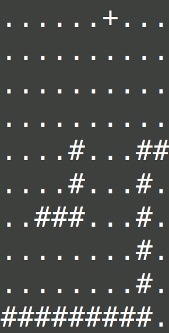
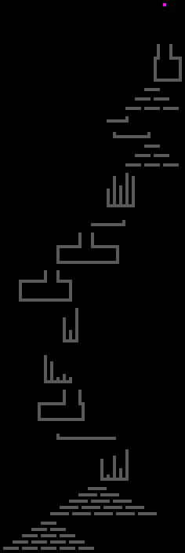
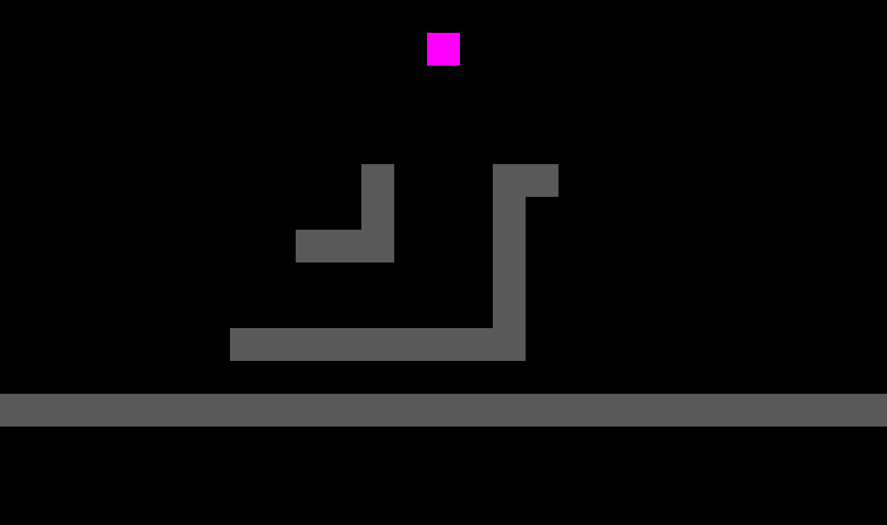
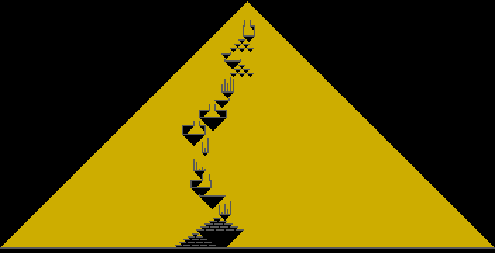

# Day 14: Regolith Reservoir

## [Part one description](https://adventofcode.com/2022/day/14) (adventofcode.com)

**tl;dr** Another simulation!  Learned about profiling-driven optimization and `pygame` for creating [animations](#gui---full-puzzle-input-multigrain)!

## Part One

### Problem Breakdown

Simulate sand falling from a specified origin onto a 2D slice of cave / rocks.  There are rules provided for how the sand moves during each simulation time step:
1. If there is nothing immediately below a falling block of sand, it falls down one space (+1 y)
2. Otherwise, if there is nothing down/left (+y, -x) then it occupies that spot.
3. Otherwise, if there is nothing down/right (+y, +x) then it occupies that spot.
4. Finally, if it cannot move it comes to rest.

The simulation stops when there are no more possible positions on the map where sand can come to rest, and instead "falls into the abyss below".

The question that needs to be answered: how many blocks of sand come to rest on the map when it is full?

### Solution

1. The input file is parsed into an in-program representation, an instance of class `Board` which contains two sets:
    - One for coords of rocks
    - Another for coords of settled sand units

    The `Board` is updated as the simulation runs and sand units fall from the source.

2. The simulation is run with discrete time steps.  When necessary, instances of class `SandUnit` are dropped from the `sand_origin` point.  Per the puzzle description, a new sand unit is dropped only when the prior one has come to rest.

3. The simulation runs until the a sand unit is "falling indefinitely".  This is detected by setting up a "bounding box" for the rocks on the `Board` upon input file parsing.  Once a sand unit crosses this bounding box, it is falling indefinitely since there are no rocks below on which it may come to rest.

### Animations

#### Terminal - example input



#### GUI - example input

I tried my hand at using `pygame` for creating a GUI animation, and I'm pleased with the results!  I was able to directly save the simulation frames as images, which was a nicer workflow than having the script take screenshots of the terminal output - no need to specify the screenshot size for cropping, since the GUI script calculates the needed window size automatically!


#### GUI - example input, "multigrain"

While I was working on the visualization of the full input, I found out that waiting to drop a new sand unit until after the prior unit was settled didn't make for a very nice viewing experience - it took *forever* watching the simulation to run!

Instead, a more realistic simulation of sand falling from a source is a constant rate of sand falling.  I updated the simulation code to accept a parameter, `time_steps_between_sand_unit_drops`, to allow me to specify the drop period.  The visualizations below use drop period of 2 time steps.

This change allows the simulation to complete in way fewer time steps, though it does mean that there is more than one sand unit "falling indefinitely" once the board fills up!  I color them red to visualize this.


#### GUI - full puzzle input, "multigrain"

The nice thing about the GUI over terminal is that I can display much more information and fit the entire board on the screen!  Behold:



## Part Two

### Problem Breakdown

New simulation end state - this time, there is an infinitely wide rock floor 2 units below the lowest rock on the board.  The simulation runs until the sand unit source is covered by a sand block, resulting in a longer simulation than for part one.

Goal - count how many sand units fall.

### Solution

#### initial attempt - too slow!

I tried minimally modifying my solution for Part One, and while this worked for the example the computation time went through the roof for the full input.

I didn't have a good sense of where the slowdown in my code was (unlike in prior puzzles), so I tried using the Python standard library's `cProfile` for the first time!  Their [quickstart guide](https://docs.python.org/3/library/profile.html) was straightforward, and I was quickly able to isolate which function was causing the issue.

Setting up the profiler:

```Python
import cProfile
# run the simulation.  Here, I am "raising" the sand origin point by 35 tiles
# this causes many more sand units to be dropped, giving a longer and more representative simulation for profiling
cProfile.run("obtain_part_two_simulated_board(inputfile='example.txt', sand_origin=Point(500, -35))", 'sim_stats')
# format the output!  sort by total time
import pstats
p = pstats.Stats('sim_stats')
p.strip_dirs().sort_stats(pstats.SortKey.TIME).print_stats()
```

Output:

```
10203670 function calls in 9.240 seconds

   Ordered by: internal time

   ncalls  tottime  percall  cumtime  percall filename:lineno(function)
   117482    4.376    0.000    7.114    0.000 {method 'union' of 'set' objects}
  4562810    2.300    0.000    2.779    0.000 point.py:34(__eq__)
   117482    1.274    0.000    8.598    0.000 solution.py:47(is_tile_occupied)
  4562810    0.479    0.000    0.479    0.000 {built-in method builtins.isinstance}
    64714    0.319    0.000    9.114    0.000 solution.py:67(fall_step)
   117533    0.103    0.000    0.142    0.000 point.py:13(__add__)
   235074    0.091    0.000    0.091    0.000 point.py:3(__init__)
   117482    0.077    0.000    7.190    0.000 solution.py:44(occupied_tiles)
    64714    0.068    0.000    9.181    0.000 solution.py:104(simulate_time_step)
   119593    0.063    0.000    0.095    0.000 point.py:42(__hash__)
```

Takeaway: `set.union()` is taking way more time than I expected, about 47% based on the `tottime` (4.276s) vs overall runtime (9.240s) numbers.

I wrote the `Board` class, which is a live representation of the current 2D-cave-slice during simulation, in the following manner (below) - every check as to whether a tile is occupied invokes `set.union`, since I am working with two sets for tracking - one for rocks and the other for settled sand units.

```Python
class Board:
    def __init__(self, sand_origin: Point):
        self.rocks = set()
        self.settled_sand = set()
        # ...
    def add_rock(self, coords: Point) -> None:
        self.rocks.add(coords)
        # ...
    def occupied_tiles(self):
        return self.rocks.union(self.settled_sand)
    def is_tile_occupied(self, tile: Point):
        return tile in self.occupied_tiles() or tile.y == self.cave_floor_y
    # ...
```

#### attempt 2 - removing `set.union` operation for speedup

Cleaning up the `Board` class:

```Python
class Board:
    # ...
    def is_tile_occupied(self, tile: Point):
        return tile in self.rocks \
            or tile in self.settled_sand \
            or tile.y == self.cave_floor_y
    # ...
```

Rerunning the same profiled setup as before (with origin point 35 units above typical for the example), we get the following printout:

```
1196036 function calls in 0.671 seconds

   Ordered by: internal time

   ncalls  tottime  percall  cumtime  percall filename:lineno(function)
    64714    0.179    0.000    0.589    0.000 solution.py:66(fall_step)
   117482    0.113    0.000    0.266    0.000 solution.py:44(is_tile_occupied)
   236913    0.083    0.000    0.118    0.000 point.py:42(__hash__)
   117533    0.079    0.000    0.109    0.000 point.py:13(__add__)
   235074    0.063    0.000    0.063    0.000 point.py:3(__init__)
```

This is an overall, profiled speedup of ~13.7x!

With this result, I was confident to re-run the sim for Part Two.  It ran in less than 30s, a much more reasonable amount of time!

### Visualizations

#### GUI - example input (sand unit drop period of 2 time steps)



#### GUI - full puzzle input (sand unit drop period of 2 time steps)

Here's the image of the final board state:



And below's a 16 minute video of the simulation running!  I created it using `ffmpeg`, with the [help of StackOverFlow](https://stackoverflow.com/a/37478183).

I ran the following command:

```
ffmpeg -framerate 60 -pattern_type glob -i '*/*.png' \
    -c:v libx264 -pix_fmt yuv420p input_gui_p2_multigrain.mp4
```