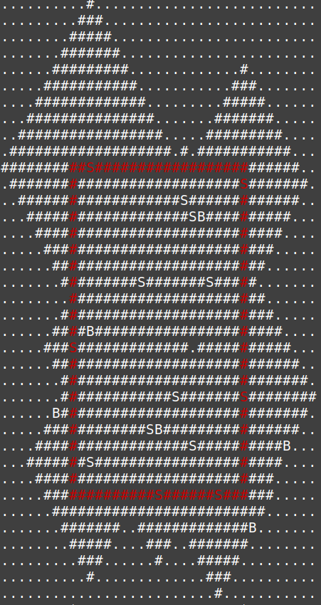
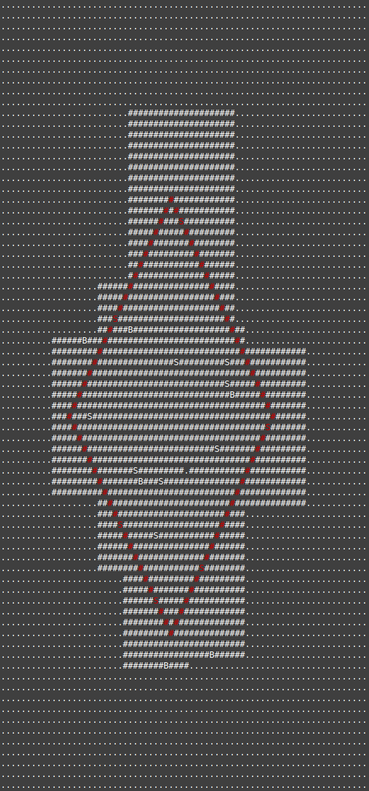
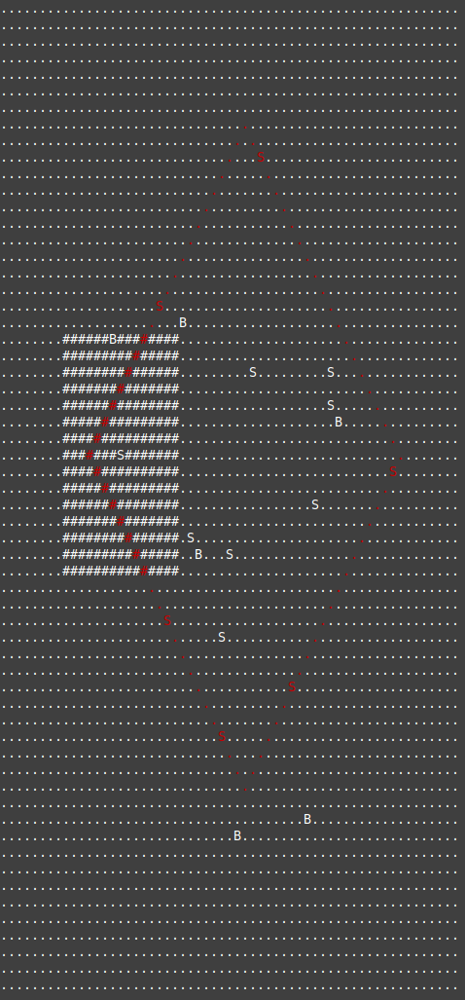

# Day 15: Beacon Exclusion Zone

## [Part one description](https://adventofcode.com/2022/day/15) (adventofcode.com)

**tl;dr** Spend much time thinking about time complexity and two-dimensional coordinate transforms.

## Part One

### Problem Breakdown

Pairs of "sensors" and "beacons" are provided, along with their coordinates on a two-dimensional grid.  Each sensor picks up the "signal" from the nearest beacon, and it is guaranteed that there are no beacons closer to the sensor (as measured by Manhattan distance).

The puzzle asks us to count how many grid tiles cannot contain a beacon for a given y coordinate.

Something to note - the example and puzzle input both contain a relatively small number of sensor/beacon pairs (14 and 29 respectively) but they differ vastly as to the distances between the sensors and beacons - the input's grid is millions of grid tiles wide / tall.

### Visualizations

#### Example, showing all sensor exclusion areas and highlighting y=10

```
..........#..........................
.........###.........................
........#####........................
.......#######.......................
......#########.............#........
.....###########...........###.......
....#############.........#####......
...###############.......#######.....
..#################.....#########....
.###################.#.###########...
##########S########################..
.###########################S#######.
..###################S#############..
...###################SB##########...
....#############################....
.....###########################.....
......#########################......
.......#########S#######S#####.......
........#######################......
.......#########################.....
......####B######################.... *** y=10
.....###S#############.###########...
......#############################..
.......#############################.
.......#############S#######S########
......B#############################.
.....############SB################..
....##################S##########B...
...#######S######################....
....############################.....
.....#############S######S######.....
......#########################......
.......#######..#############B.......
........#####....###..#######........
.........###......#....#####.........
..........#.............###..........
.........................#...........
```

### Solution

To solve this problem effectively, my solution could not iterate over the x or y coordinates involved since the input's grid size is so large.

This is the solution at which I eventually arrived:

1. Each sensor contains a function that takes an argument, a row y and returns the `range` of x values within its no-beacon zone:

    ```python
    class Sensor:
        def __init__(self, coords: CoordPair, nearest_beacon_coords: CoordPair):
            self.coords = coords
            self.nearest_beacon_coords = nearest_beacon_coords
            self.radius = abs(coords.x - nearest_beacon_coords.x) + abs(coords.y - nearest_beacon_coords.y)
            def excluded_x_range(y):
                x_len = self.radius - abs(self.coords.y - y)
                return range(self.coords.x - x_len, self.coords.x + x_len + 1)
            self.excluded_x_range = excluded_x_range
            # ...
    ```

2. For a given y value, we can loop through all the sensors and focus on those whose no-beacon zone includes the given y and make a list of their exclusion ranges:

    ```python
    valid_sensor_excl_ranges = [s.excluded_x_range(y) for s in sensors \
                                if s.coords.y - s.radius <= y <= s.coords.y + s.radius]
    ```

3. Now, we *unify* the ranges and reduce the list of ranges to the minimum number of ranges (1+).

    - To start, we define a function that tries to unify two ranges (both of step size = 1):

        ```python
        def attempt_range_unification(r1, r2):
            if r1.start in r2 or (r1.stop - r1.step) in r2 \
                    or r2.start in r1 or (r2.stop - r2.step) in r1 \
                    or r1.stop == r2.start or r1.start == r2.stop:
                return range(min(r1.start, r2.start), max(r1.stop, r2.stop))
            return None
        ```

    - Then, we run this function on all unique combinations of range pair from input collection and write down results (either that they can be combined (a `range` is returned) or that they cannot (`None`)).

        This information will allow us to unify the overall collection!

        The results are placed into a dictionary within the script, but on paper this would look like a matrix of combinations:

        |         | range_1 | range_2 | range_3 | range_4 | ...
        | -       | ------- | ------- | ------- | ------- | ---
        | range_1 | x       | y/n     | y/n     | y/n     |
        | range_2 | x       | x       | y/n     | y/n     |
        | range_3 | x       | x       | x       | y/n     |        
        | range_4 | x       | x       | x       | x       |
        | ...     |         |         |         |         | ...
        
    - Finally, we can "look through" the table and match pairs of ranges together.

        Let's say we have the table below:

        |         | range_1 | range_2 | range_3 | range_4
        | -       | ------- | ------- | ------- | -------
        | range_1 | x       | y       | n       | y    
        | range_2 | x       | x       | n       | n    
        | range_3 | x       | x       | x       | y            
        | range_4 | x       | x       | x       | x      

        The ranges involved might look like this:

        ```
                     ......... (1)
        (2) ............            ............ (3)    
                           .............. (4)

            .................................... (unified)
        ```

        - To start, we pick a single range (say, 2).
        - We check whether range_2 can be merged with any other ranges - in this case, with range 1.  Our current merge goes (2 -> 1)
        
        - Then, we look at range_1: it can be merged with range_4 (we've already looked at range_2).  Our current merge is (2 -> 1 -> 4)

        - Then, we look at range_4: it can be merged with range_3 (we've already looked at range_1).  Our current merge is (2 -> 1 -> 4 -> 3).

        This example is part of a generic algorithm that works on ranges that may or may not overlap!  I used a stack to keep track of which range we're currently looking at, and a set to keep track of which ranges we've already looked at and which remain.

4. Having unified the ranges, we can now answer the question!  It's the sum of lengths of the unified ranges, in addition to the count of any sensors and beacons that are along the row (only one sensor or beacon may exist in a grid tile, they do not stack).

## Part Two

### Problem Breakdown

The layout of the sensors, beacons, and sensor no-beacon zones was very intentional - within a specific square bounding box, there is guaranteed to be a *single* free spot.  For the example, this bounding box is 20 tiles on each side, but for the input it's 4 *million* tiles.

My solution from part 1 ran quickly (a single `time`d run took 0m0.034s) but looking at 4 million rows would take *37 hours*.  That's simply infeasible, and I knew there was a better way, but it took me a long time to come up with it!

### Visualizations

#### Example, original coordinate system



#### Example, coord system rotated 45deg counter-clockwise



### Solution

I was stuck thinking through this puzzle for several days.  I thought of rotating the coordinate system to make the sensor no-beacon zones square instead of diamonds, but didn't see how that would lead to an easier solution.

Eventually I implemented the rotation out of desperation, but upon making the visual I realized that the squares no-beacon zones, coupled with the diamond search boundary have a very nice property.  When looking "away" from the diamond's center line, the square zones have the same x-range across the entire range of y coordinates!  Visualized:



This means that, for this sensor, the row on which I perform "row unification" logic (from p1) doesn't matter - as long as it's within the yrange of the sensor and no other sensors' boundaries end, we'll get the same result!  This allows me to be way more selective about the number of rows to evaluate - *O(number of sensors)* instead of *O(number of rows)* -- 29 is *way* less than 4 million!

Additionally, the diamond search area can be divided into two triangular halves (for me, about the y-axis).  A nice property is that as we move away from the center line, the x-range of the search area decreases - this means that if a unified row covers the width of the search area for row N, the next row N+1 further from the center line will also be covered as long as the same sensors are present and no sensors' boundaries have ended.